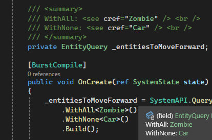
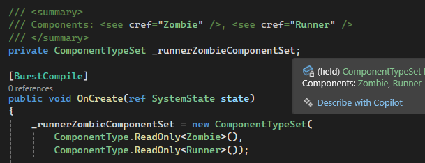

## Unity ECS Summarizer
Simple Visual Studio extension that adds summaries to Unity ECS EntityQueries and ComponentTypeSets

## Examples
As of now, the extension can be used to display which components are (not) in the EntityQuery:

Or which components are contained in the ComponentTypeSet.

It is most useful with big queries or sets to quickly check which components they contain.

## Contributors
- [larchman01](https://github.com/larchman01)